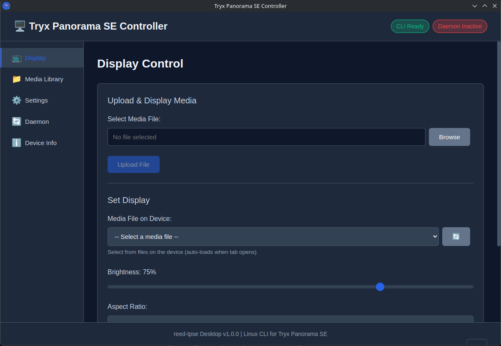

# TRYX Panorama SE Controller

Modern Electron-based GUI for controlling Tryx Panorama SE AIO cooler display on Linux.

**Independent Node.js/Electron Implementation** - Rewritten from scratch with pure Node.js, no external CLI binary required!

_Inspired by [reed-tpse](https://github.com/fadli0029/reed-tpse) by [@fadli0029](https://github.com/fadli0029)_



## Features

- 🖥️ **Display Control** - Upload and set media files (videos, GIFs, images)
- 📁 **Media Library** - Browse and manage files on device
- ⚙️ **Settings** - Configure port, brightness, and keepalive intervals
- 🔄 **Daemon Management** - Control background service for persistent display
- ℹ️ **Device Info** - View detailed device information
- 🎨 **Modern UI** - Dark theme with intuitive navigation
- ⚡ **Native Implementation** - Direct serial communication via Node.js/serialport

## Prerequisites

**System Requirements:**
- **Node.js** >= 16.x
- **npm** >= 8.x
- **adb** (android-tools) - for file transfers
- **ffmpeg** - for GIF to MP4 conversion

**No CLI binary needed!** Everything runs natively in Node.js.

**Permissions:**
- User must be in `uucp` group (Arch) or `dialout` (Debian/Ubuntu) for serial access
- Or run with sudo (not recommended)

## Installation

```bash
cd desktop-app
npm install
```

This will install Electron and serialport (for serial communication).

## Running

### Development Mode

```bash
npm start
```

Or use the convenience script:
```bash
./start.sh
```

### Building Packages

Build for Linux:
```bash
npm run build:linux
```

Build specific formats:
```bash
npm run build:deb      # Debian/Ubuntu .deb package
npm run build:rpm      # RedHat/Fedora .rpm package
npm run build:appimage # Universal AppImage
```

Packages will be created in the `dist/` directory.

## Usage

1. **Connect Device**: Ensure your Tryx Panorama SE is connected via USB
2. **Launch App**: The app will auto-detect the device on `/dev/ttyACM*`
3. **Upload Media**: Use the Display tab to browse and upload files
4. **Set Display**: Select media and adjust brightness
5. **Enable Daemon**: Keep display persistent across reboots

### Tabs Overview

- **Display**: Upload files and control what's shown on the display
- **Media Library**: View, select, and delete files on device (via ADB)
- **Settings**: Configure serial port, default brightness, and keepalive interval
- **Daemon**: Start/stop background keepalive service
- **Device Info**: View hardware and firmware information

## Architecture

This app uses a **pure Node.js implementation** of the reed-tpse protocol:

```
desktop-app/
├── main.js           # Electron main process
├── preload.js        # Context bridge for IPC
├── renderer.js       # UI logic
├── index.html        # Interface
├── styles.css        # Styling
├── package.json      # Dependencies
└── lib/              # Node.js implementation
    ├── protocol.js   # Frame building/parsing
    ├── device.js     # Serial communication (serialport)
    ├── adb.js        # File transfers
    ├── media.js      # Media handling & conversion
    └── config.js     # Configuration management
```

### How It Works

1. **Serial Communication**: Uses `serialport` npm package to communicate directly with `/dev/ttyACM*`
2. *Permission Denied (Serial Port)

Add your user to the appropriate group:
```bash
# Arch Linux
sudo usermod -aG uucp $USER

# Debian/Ubuntu
sudo usermod -aG dialout $USER
```

Log out and back in for group changes to take effect.

### Device Not Detected

1. Check USB connection
2. Verify device is visible: `ls /dev/ttyACM*`
3. Check permissions on `/dev/ttyACM*`

### ADB Device Not Found

1. Enable ADB on the device display
2. Check connection: `adb devices`
3. If unauthorized, accept prompt on device

### FFmpeg Not Found

Install ffmpeg for GIF conversion:
```bash
# Arch Linux
sudo pacman -S ffmpeg

# Debian/Ubuntu
sudo apt install ffmpeg
```

## Development

Directory structure:
```
desktop-app/
├── main.js           # Electron main process
├── preload.js        # Context bridge for IPC
├── renderer.js       # Renderer process (UI logic)
├── index.html        # Main UI
├── styles.css        # Styling
├── package.json      # Dependencies and scripts
├── lib/              # Node.js implementation modules
│   ├── protocol.js   # Protocol implementation
│   ├── device.js     # Device communication
│   ├── adb.js        # ADB operations
│   ├── media.js      # Media handling
│   └── config.js     # Config management
└── assets/           # Icons and images
```

### Security

- Context isolation enabled
- Node integration disabled in renderer
- IPC communication via preload script
- No remote content loading

### Adding Features

1. **Protocol**: Modify `lib/protocol.js` for frame handling
2. **Device Commands**: Add methods in `lib/device.js`
3. **IPC Handlers**: Add handlers in `main.js`
4. **UI**: Update `renderer.js` and `index.html`
Log out and back in for group changes to take effect.

### Device Not Detected

1. Check USB connection
2. Verify device is visible: `ls /dev/ttyACM*`

## Development

Directory structure:
```
desktop-app/
├── main.js           # Electron main process
├── preload.js        # Context bridge for IPC
├── renderer.js       # Renderer process (UI logic)
├── index.html        # Main UI
├── styles.css        # Styling
├── package.json      # Dependencies and scripts
└── assets/           # Icons and images
```

### Security

- Context isolation enabled
- Node integration disabled
- IPC communication via preload script
- No remote content loading

## License

MIT - Same as reed-tpse parent project

## Contributing

Issues and pull requests are welcome! Feel free to contribute to this independent implementation.

## Credits

### Acknowledgments

This project is an **independent reimplementation** inspired by [reed-tpse](https://github.com/fadli0029/reed-tpse) by [@fadli0029](https://github.com/fadli0029). The original project was rewritten from scratch using Node.js and Electron to provide a desktop GUI application.

**Original Concept**: [@fadli0029](https://github.com/fadli0029)  
**Original Repository**: https://github.com/fadli0029/reed-tpse  
**This Implementation**: Independent rewrite in Node.js/Electron

### Built With

- [Electron](https://www.electronjs.org/) - Cross-platform desktop apps
- [electron-builder](https://www.electron.build/) - Package builder
- [serialport](https://serialport.io/) - Serial communication

An independent controller for Tryx Panorama SE displays on Linux.
